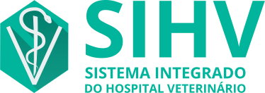
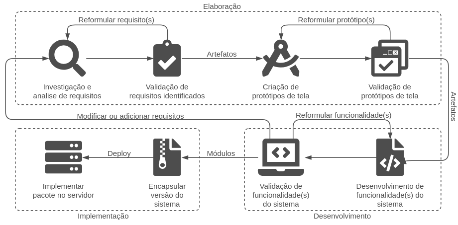
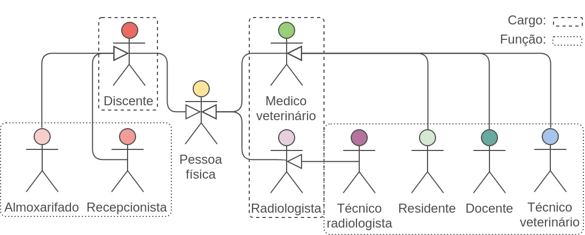
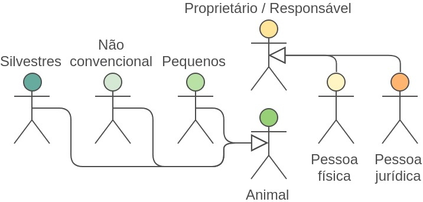
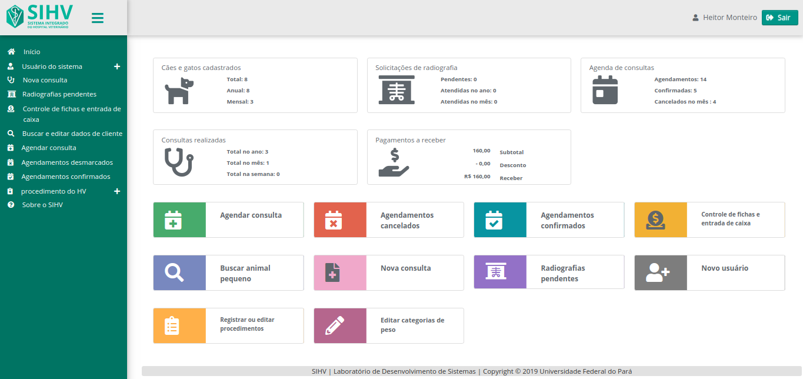

___

> O projeto compõe o desenvolvimento prático de meu trabalho de conclusão de curso realizado na Universidade Federal do Pará (UFPA). Consistindo numa proposta de software-web delineado para o gerenciamento e sistematização de atividades cotidianas do Hospital Veterinário (HV) da UFPA Castanhal.

## Configurações de desenvolvimento

- **Netbeans 8.2:** Ambiente de Desenvolvimento Integrado (IDE, do inglês Integrated
  Development Environment) utilizado para codificar o frontend, backend e HQLs do framework Hibernate;

- **Glassfish:** servidor de aplicações usado para executar o software-web. A versão utilizada no desenvolvimento acompanha o Netbeans 8.2, e foi habilitada durante o processo de instalação;

- **MySQL Workbench:** utilizado para modelar e editar graficamente a estrutura do Diagrama de Entidade e Relacionamento do projeto;

- **Gitkraken:** software desktop utilizado para administrar commits e branches correspondentes a modificações realizadas no projeto;

## Etapas do desenvolvimento da aplicação

A figura 1 ilustra o processo utilizado na construção do sistema veterinário, do qual dividi-se em três momentos: elaboração; desenvolvimento; e implementação do web-software. Cada um possuindo subprocessos com objetivos estabelecidos, e gerando artefatos específicos para posterior utilização em etapas seguintes.

> **Figura 1** – Processo de desenvolvimento
> 

## Interfaces de usuário do SIHV

### Stakeholders diretos

O caso de uso ilustrado na Figura 2, apresenta os stakeholders diretos do sistema, do qual se demonstra a generalização e especialização de utilizadores da aplicação veterinária, essa divisão equivale ao cargo (retângulo tracejado) e função (retângulo pontilhado) do usuário

> **Figura 2** – Usuários do sistema
> 

### Stakeholders indiretos

A Figura 3 apresenta os stakeholders indiretos do sistema, esse grupo de indivíduos é composto por clientes que usufruem de serviços prestados pelo HV. Os atores que compõem a imagem acima são: o proprietário ou responsável pelo animal, podendo ser pessoa física ou jurídica; e o animal, possuindo as especializações de pequenos, não convencionais e silvestres.

> **Figura 3** – clientes do HV
> 

### Dashboard do SIHV

A tela principal do sistema ilustrada na Figura 4, consiste no ponto de partida para seus usuários acessarem funcionalidades do software, e conforme seu cargo e função, ou poderes atribuídos ao mesmo durante o cadastro. A aplicação disponibiliza funcionalidades condizentes com atribuições do individuo.

> **Figura 4** – clientes do HV

## Fonte textual e gráfica

**SOBRAL**, Heitor Monteiro da Silva. Sistema integrado do Hospital Veterinário da UFPA Campus Castanhal. 2019. Trabalho de Conclusão de Curso (Bacharelado em Sistemas de Informação) -- Campus Universitário de Castanhal, Universidade Federal do Pará, Castanhal, 2019. Disponível em: https://bdm.ufpa.br/jspui/handle/prefix/2127.

